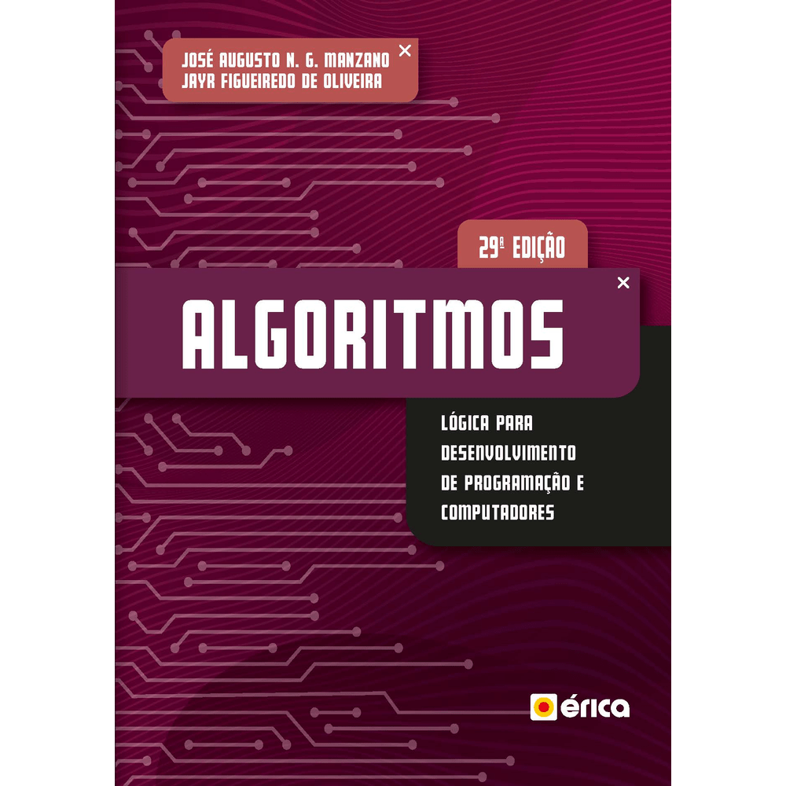

# Repositório de Resoluções dos Exercícios do Livro Algoritmos - Lógica para Desenvolvimento de Programação de Computadores
Este repositório contém as resoluções dos exercícios do livro "Algoritmos - Lógica para Desenvolvimento de Programação de Computadores". O objetivo é fornecer um recurso útil para estudantes que estão aprendendo sobre algoritmos e lógica de programação.

## Livro de Referência
- **Título:** Algoritmos - Lógica para Desenvolvimento de Programação de Computadores
- **Autor:** José Augusto N.G. Manzano e Jaya Figueiredo de Oliveira - 29ª Edição
- **Editora:** ÉRICA
- **Ano de Publicação:** 2019
- Obs.: Logo abaixo você pode ver uma descrição do livro, caso tenha interesse em conhecer mais sobre ele.

## Estrutura do Repositório
O repositório está organizado por capítulo do livro. Cada capítulo contém uma pasta com as resoluções dos exercícios daquele capítulo. As resoluções são implementadas na linguagem de programação Python.

### Listagem de exercícios deste repositório
- **Capítulo 1**: Abordagem Contextual
- **Capítulo 2**: Algoritmos e a Lógicade Programação
- **Capítulo 3**: Programação com Sequência
- **Capítulo 4**: Programação com Decisão
- **Capítulo 5**: Programação com Laços
- **Capítulo 6**: Estruturas de Dados Homogêneas de Uma Dimensão
- **Capítulo 7**: Aplicações Básicas com Matrizes de Uma Dimensão
- **Capítulo 8**: Estruturas de Dados Homogêneas de Duas Dimensões
- **Capítulo 9**: Estruturas de Dados Heterogêneas
- **Capítulo 10**: Subprogramas
- **Capítulo 11**: Programação Orientada a Objetos
- **Capítulo 12**: Aplicação Básica de POO

## Ferramentas e Recursos
- **Ambiente de Desenvolvimento:** VSCode
- **Bibliotecas Utilizadas:** Nenhuma até o momento

## Sobre o Livro

A obra aborda aspectos históricos, como origem, fundamentação, breve análise da programação estruturada em comparação com a programação orientada a objetos. Apresenta o resumo dos principais termos usados e discute a questão do polimorfismo versus poliformismo. Também trata de classe, objeto, atributo, método, herança e encapsulamento, com alguns exemplos de aplicação para auxiliar a compreensão.
Nesta edição foram acrescentados a implementação de um exemplo de uso de matriz em estilo dinâmico e o exemplo do programa calculadora codificado na linguagem de programação D.
É indicada a estudantes de programação de computadores interessados em aprender e usar técnicas de programação com foco na norma ISO 5807:1985.

## Como Usar
Para usar este repositório, você pode:
1. Clonar o repositório para o seu computador.
2. Acessar a pasta que você deseja usar.
3. Ler o código e entender como o problema foi solucionado (para os exercícios).
4. Executar o código para testar a solução (para os exercícios).
5. Resolver os exercícios extras.
6. Aprender com os tutoriais.

Happy coding!
